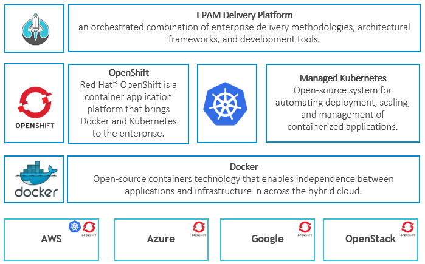

# EDP Architecture 2.0

EPAM Delivery Platform (EDP) is suitable for all aspects of delivery starting from development including the capability to deploy production environment. 
EDP architecture is represented on a diagram below.


_Diagram 1. EDP High-Level Architecture._ 

EDP consists of three cross-cutting concerns:

1. [Infrastructure as a Service](#Infrastructure_as_a_Service);
2. [Container orchestration and centralized services](#Container_Orchestration_and_Centralized_Services);
3. [Security](#Security).

On the top of these indicated concerns, EDP adds several blocks that include:

* **EDP CICD Components**. EDP component enables a feature in CICD or an instance artifacts storage and distribution (Nexus or Artifactory), static code analysis (Sonar), etc.;
* **EDP Artifacts**. This element represents an artifact that is being delivered through EDP and presented as a code. 

    >_Artifact samples: frontend, backend, mobile, applications, functional and non-functional autotests, workloads for 3rd party components that can be deployed together with applications._

* **EDP development and production environments** that share the same logic. Environments wrap a set of artifacts with a specific version, and allow performing SDLC routines in order to be sure of the artifacts quality; 
* **Pipelines**. Pipelines cover CICD process, production rollout and updates. They also connect three elements indicated above via automation allowing SDLC routines to be non-human;

    _**NOTE:** To get more detailed information about the indicated above elements, please refer to [Main EDP Elements](#Main_EDP_Elements) section._ 

### <a name="Infrastructure_as_a_Service"></a> Infrastructure as a Service
EDP starts on the infrastructure level and assumes to cover all managed IaaS solutions. EDP expects from IaaS to provide the following services:

* DNS;
* L4 and L7 load balancer;
* Virtual machines with optional support of vertical and horizontal scaling;
* Data volumes;
* Distributed file systems.

EDP does not manage infrastructure by itself and relies on capability of the IaaS provider.

### <a name="Container_Orchestration_and_Centralized_Services"></a> Container Orchestration and Centralized Services
EDP treats container as the first-class citizen. Any element that comprises EDP architecture is either a container, which can be managed by production-ready orchestrator, or a managed service available via well-known protocols.
EDP also relies on centralized services that are coming together with the container orchestration and/or IaaS. Find below the bare minimum of the services:

* Centralized logging available for all containers deployed to EDP;
* Centralized monitoring that covers IaaS, managed service or container.

### <a name="Security"></a> Security
EDP cares a lot about security by covering several important aspects, namely:

* Data at rest (for details, please refer to [EDP Data at Rest](https://kb.epam.com/display/EPMDEDP/EDP+Data+at+Rest);
* Data in transit; 
* Secured access for end-users. This point is crucial for EDP being a part of the EPAM ecosystem. 

EDP provides access only for a limited number of users who are authorized to work with resources, providing centralized management of authorization. 
Centralized authentication and Single Sign-On are also a part of EDP. For details, please refer to [EDP Single Sign-On](https://kb.epam.com/display/EPMDEDP/EDP+SSO).

## <a name="EDP_Technology_Stack"></a> EDP Technology Stack

Explore the EDP technology stack diagram that covers the cross-cutting concerns described above: 



_Diagram 2. EDP Technology Stack._

_**NOTE**: OpenShift is available in all indicated clusters, and Kubernetes is available in AWS._ 

The EDP IaaS layer supports most popular public clouds AWS, Azure and GCP keeping the capability to be deployed on private/hybrid clouds based on OpenStack.
EDP containers are based on [Docker technology](https://www.docker.com/), orchestrated by Kubernetes compatible solutions. 

There are two main options for Kubernetes provided by EDP:

* Managed Kubernetes in Public Clouds to avoid installation and management of Kubernetes cluster, and get all benefits of scaling, reliability of this solution;
* OpenShift that is a Platform as a Service on the top of Kubernetes from Red Hat. OpenShift is the default option for on-premise installation and it can be considered whether the _solution built on the top of EDP_ should be **cloud-agnostic** or require **enterprise support**;

There is no limitation to run EDP on vanilla Kubernetes, with the only notice that EDP documentation does not provide detailed instructions on how to run and maintain solution on such platform.

### Additional Technologies for Cross-Cutting Concerns

Familiarize yourself with the additional technologies for cross-cutting concerns:

1. **Security**. EDP uses Keycloak from Red Hat to decouple authentication, authorization and SSO concerns from other EDP elements.

2. **Centralized logging**. EDP operates well with any solution that can receive logs from Docker container deployed on Kubernetes cluster. The default choice for a log collector in EDP ecosystem is Fluentd that runs DaemonSet on every node and sends it to the aggregator.
The default logging stack recommended by EDP is ElasticSearch FluentD Kibana (EFK). EDP also performs well with Splunk, considering FluentD as a log collector in this case as well.


3. **Monitoring**. EDP cares a lot about monitoring of the elements that comprise it ecosystem. 
Considering the distributed and volatile nature of resources, EDP needs to collect the following metrics:

    * Kubernetes nodes,
    * Data volumes,
    * Network,
    * Containers,
    * Application inside containers.

    The EDP monitoring system disposes of alert management for proactive monitoring. The default recommendation for monitoring in EDP is **Prometheus** and **Grafana**.
    Besides this option, EDP was already tested with New Relic and Dynatrace that brought experience with monitoring to enterprise-level of modern APM solutions.

## <a name="Main_EDP_Elements"></a> Main EDP Elements
As it was mentioned above, EDP elements enable the SDLC process on the top of cross-cutting concerns. Inspect the purpose of concerns in detail and get more information on how EDP allows to customize and extend them. 

### EDP Architecture Principles
Inspect the list below in order to become familiar with the EDP architecture principles:

* EDP Architecture is practical, not theoretical. We are building something huge, but iteratively. If all quality gates are passed, then everything is fine.
* EDP Architecture follows Kubernetes architecture and recommendations.
    * We do not reinvent the wheel, we are building EDP in the same way; 
* EDP Architecture is event-driven, all major actions should be performed in a reactive way.

> _Example: If we need to wait for some sync operations to be completed, e.g. pushing to Git, creating of some resources; we do it in the async way using K8S capabilities._

* Only one Operator has knowledge about EDP component and its client. Interaction is happening through REST, SSH or any other protocol supported by a client for CICD application.
* One K8S customer resource is mutated by ONLY one controller. On the other hand, K8S Operator can listen to changes at any amount of custom resources.
* If business logic requires interaction between operators to schedule a task, it is achieved by creating a new corresponding custom resource.
* The analogy comes from Deployment Kind processing in K8S, which creates a ReplicaSet and the pods.
* Controller work is in idempotent way and should support a self-healing and cascade deletion process.

> _Example: If Gerrit repository already exists, it should be taken into account and do not lead to a permanent failure_.

* Custom resources and controller are bounded by api version, and several controllers can be launched in parallel. Controllers have the ability to watch specific namespaces.
* Custom resources sections are clearly defined:
    * Spec is defined and mutated only by a requester;
    * Metadata and annotations are used by its own Operator (_the one is responsible for mutation_) and other operators (_ones listens to changes_);
    * Status is mutated by operator and provide resource information.

### EDP Component Overview
EDP Component enables some SDLC feature by wrapping some well-known tools, e.g. Jenkins, Nexus, Sonar etc. EDP Component abstraction allows to organize framework for adding, extending and customizing different tools.

Find below the list of the main requirements that drive EDP Component architecture:

* EDP Component is naively managed by Kubernetes;
* EDP Component supports upgrade procedures;
* EDP Component can be optional and replaceable for different EDP installations;
* EDP Component provides information about its configuration that is visible and accessible by other EDP Components;
* Changes in EDP Component configuration are published via Kubernetes events and are available for consumption by other components;
* There should be no strict dependencies in the order of EDP Component installation;
* EDP Component can be added/removed after the EDP installation; 
* EDP Component has an independent release life cycle and can be developed by core team and contributors;
* EDP version consists only of the released EDP Component versions; 

In order to address the requirements indicated above, the [Kubernetes Custom Resources](https://kubernetes.io/docs/concepts/extend-kubernetes/api-extension/custom-resources/#custom-controllers) were chosen to manage each EDP Component separately, instead of trying to create a unified installation script. 

The [Operator Framework](https://coreos.com/operators/) simplifies and standardizes the implementation of custom resources for EDP Components.

The following CustomResourceDefinition represents any EDP component:

```yaml
apiVersion: apiextensions.k8s.io/v1beta1
kind: CustomResourceDefinition
metadata:
  name: edpcomponents.edp.epam.com
spec:
  group: edp.epam.com
  names:
    kind: EdpComponent
    listKind: EdpComponentList
    plural: edpcomponents
    singular: edpcomponent
    shortNames:
      - ec
  scope: Namespaced
  version: v1alpha1
```
A specific EDP Component adds more information, namely:

* EDP Component name (Jenkins, Gerrit, etc.);
* Configuration for installation (Docker version, volume for pvc, etc.);
* Links to component configuration exposed for other components. 

The list contains a **pair**, which K8S object name and its kind produce during the installation, thus allowing to get information about EDP Component through K8S API.

Such information can be displayed as the _CustomResource_ for Jenkins:

```yaml
apiVersion: edp.epam.com/v1alpha1
kind: EdpComponent
metadata:
  name: jenkins
spec:
  version: "1.10.4"
  type: "jenkins"
  configuration:
  - name: jenkins-user
    kind: secret
  - name: jenkins-builders
    kind: configmap 
  volumes:
  - name: "data"
	capacity: "1Gi"
  cacheStorage:
    enabled: true
    capacity: "1Gi"
  builders:
  - name: npm
    image: "openshift/jenkins-agent-nodejs-8-centos7:v3.10"
  - name: maven
    image: "openshift/jenkins-slave-maven-centos7"
  - name: gradle
    image: "epamedp/jenkins-slave-gradle-openshift:1.10.0"
```

Each specific EDP Component comes together with K8S Controller that can react on CR creation and perform the installation: 

 

_Diagram 3. EDP Component Interrelationship._

As it was previously mentioned, EDP Component wraps CICD tool represented by Docker. In order to deploy this application to Kubernetes/OpenShift cluster, a set of Kubernetes/OpenShift needs should be created as Pod, Service, Deployment (Kubernetes), DeploymentConfig (OpenShift), Route (OpenShift) etc. 
The EDP Component Controller is a central element to manage CICD tool installation and configuration. 
Based on the data from metadata, the K8S Custom Resource Controller provisions are necessary objects and perform tool configuration. 
This controller is responsible for consuming configuration of other EDP Components and exposing its own configuration for others. 

Some configuration samples are described in a custom resource for Jenkins. Find more description below:

```yaml
apiVersion: v1
kind: ConfigMap
metadata:
  name: keycloak-realm-provisioner-service
data:
  maven: enabled
  groovy: disabled
  npm: enabled
```

The sequence diagram below displays the integration process during the EDP Components provisioning:
 


_Diagram 4. EDP Component Integration._

Inspect the full list of [EDP Components](../documentation/edp_components.md), which are available out of the box, with the respective description of configurations and integrations.
EDP architecture encourages to implement all elements of EDP Component to guarantee repeatability, quality and the best practices sharing. EDP provides a simple way to add a new component by installing a necessary CICD tool via Kubernetes/OpenShift capabilities, as well as to configure manually this component.

### EDP Component Integration Points

Each component should expose its configuration for integration with other EDP Component through its own CR. For instance, if Sonar needs to be integrated with Jenkins, it is necessary to expose Jenkins credentials data for inside Sonar CR. 
For these purposes, each CR should contain the **externalConfiguration** block inside its specification, which will be filled in with the corresponding parameters during the provisioning via K8S Operator. 

The **externalConfiguration** block should be aligned with the following convention:

```yaml
apiVersion: edp.epam.com/v1alpha1
kind: EdpComponent
metadata:
  name: jenkins
spec:
  type: "Sonar"
  version: '7.1'
  volumes:
    - name: "data"
      storage_class: "efs"
      capacity: "1Gi"
    - name: "db"
      storage_class: "efs"
      capacity: "1Gi"
  externalConfiguration:
    ciUser:
      kind: Secret
      name: Any
      description: Credentials for ci server with scan access rights
    readUser:
      kind: Secret
      name: Any
      description: Credentials for user with read access rights
    adminUser:
      kind: Secret
      name: Any
      description: Credentials for user with admin access rights
    configuration:
      kind: ConfigMap
      name: Any
      description: Configuration of Sonar
```

The **ciUser**, **readUser**, **adminUser**, and **configuration** keys of the **externalConfiguration** map are the exact point of integration with other EDP Components (_i.e. EDP Component can retrieve all necessary data for integration_). 

---
### Related Articles
 
* [Add a New EDP Component](../documentation/add_new_edp_component.md) - adding a new component after the installation.