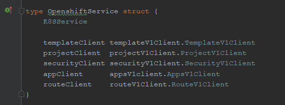

# Develop an EDP Operator

## Trivia

EDP team uses the Operator SDK as an example, and follows the recommended guidelines from developers of the aforementioned SDK. In order to align all current and future Operators, which are going to be developed under EDP project aegis, explore some basic guidelines and common conventions that are expected from developers. 

Also, it is highly recommended to get accustomed with the following coding guidelines that are general for all Golang projects: [Go Code Review Comments](https://github.com/golang/go/wiki/CodeReviewComments#go-code-review-comments).

Inspect the terms below:

* **Operator** — a process that resides in K8S or OpenShift cluster and listens for new Custom Resources with applications for this Operator Kind. 
Operators are purpose-built to run a Kubernetes application that understands how to create and provision EDP Component and EDP Component Object with provided values and capabilities, 
described in the [Operator capability level](https://github.com/operator-framework/operator-sdk#operator-capability-level) block.

* **EDP Component** — a tool registered or installed in EDP (e.g. Jenkins, SonarQube, Nexus, etc.). Usually, but not always, EDP Component describes a Kind of Custom Resource. Though, there are Kinds that are not EDP Component, e.g. Codebase, CodebaseBranch, etc.

* **EDP Component Object** — a part of EDP Component that is used to represent a state or a part of the desired state in the K8S ecosystem (e.g. JenkinsFolder, KeycloakInstaller, etc.). 

* **Scheme** — a scheme that provides mappings between Kinds and their corresponding Go types. The scheme defines methods for serializing and de-serializing API objects, a type registry for converting group, a version, Kind information to/from Go schemas, and mappings between Go schemas of different versions. The Scheme is a foundation for a versioned API and versioned configuration over time.

## Project Structure

Currently, EDP team uses a boilerplate project layout that is provided by Operator SDK from the start.

| Files / Folders | Purpose  |
|---|---|
| cmd | It contains `manager/main.go` that is the main program of the Operator. This instantiates a new manager that registers all custom resource definitions under `pkg/apis/...` and starts all controllers under `pkg/controllers/...` .| 
| pkg/apis | It contains the directory tree that defines the APIs of the Custom Resource Definitions (CRD). Users are expected to edit the `pkg/apis/<group>/<version>/<kind>_types.go` files to define the API for each resource type, and import these packages in their controllers in order to track these resource types.|
| pkg/controller | This pkg contains the controller implementations. Users are expected to edit the `pkg/controller/<kind>/<kind>_controller.go` to define the controller's reconcile logic for handling a resource type of the specified kind.|
| pkg/controller/helper | An auxiliary package that contains functions used for a specific purpose only (e.g. find strings in a slice, create some generic values, etc.) and does not have any logic directly related to the package.|
| pkg/service | It is introduced by the EDP team; it contains all business logic for creating EDP Component/EDP Component Object resources (e.g. Secret, DeploymentConfig, ServiceAccount etc.) and configuration for EDP Component itself (configuration properties, style guides, quality gates, etc.).|
| pkg/service/<component> | It has invocation of platform methods and default values that are used to create and configure EDP Component/EDP Component Object (e.g. Jenkins, GerritReplicationConfig, KeycloakRealm, etc.).|
| pkg/service/platform | It contains a platform-specific implementation for the required K8S/OpenShift resources creation and configuration (e.g. Secret, DeploymentConfig, ServiceAccount). |
| pkg/service/platform/k8s | It contains Kubernetes specific logic. |
| pkg/service/platform/openshift | It contains OpenShift specific logic. |
| pkg/service/platform/helper | An auxiliary package that contains functions used for a specific purpose only (find strings in a slice, create some generic values, etc.) and does not have any logic directly related to the package.|
| pkg/client | It is introduced by the EDP team; a REST client for communication with EDP Component API, if required. It contains methods, specific for EDP Component configuration (e.g. plugin installation, quality gate creation, etc.).|
| build | It contains the `Dockerfile` and build scripts used to build the Operator. Also, it can contain some configuration files that are expected to be in EDP Component.|
| deploy | It contains various of YAML manifests for registering CRDs, setting up [RBAC](https://kubernetes.io/docs/reference/access-authn-authz/rbac/), and deploying the Operator as a deployment.|
| (Gopkg.toml Gopkg.lock) or (go.mod go.sum) | The [Go modules](https://github.com/golang/go/wiki/Modules#go-modules) or [Go Dep](https://github.com/golang/dep#dep) manifests that describe the external dependencies of this Operator, depending on the dependency manager chosen when initializing or migrating a project.|
| vendor | The Golang [vendor](https://golang.org/cmd/go/#hdr-Vendor_Directories) folder contains the local copies of the external dependencies that satisfy the imports of this project. [Go Dep](https://github.com/golang/dep#dep) / [Go modules](https://github.com/golang/go/wiki/Modules#go-modules) manage the vendor directly.|

## Service

The service level is introduced as a measure to abstract and contain Operators business logic, and leave a controller its controlling function, but hide beneath implementation details.
 
It is recommended to apply the following package layout:

#### ```pkg/service```

```bash
<EDP Component>
<EDP Component>/<EDP Component>.go  
<EDP Component>/spec/spec.go
platform/helper/helper.go
platform/openshift/openshift.go
platform/k8s/k8s.go
platform/platform.go
```

The main idea is that Operators, provided by the EDP team, can be used on different platforms. Currently, there are Kubernetes and OpenShift platforms. In order to achieve this goal, the PlatformService interface is introduced.

#### ```pkg/service/platform/helper/helper.go```

It is a list of auxiliary functions that are not related to business logic directly.

#### ```<EDP Component>/spec/spec.go```

These are constants that represent default values provided by the EDP team for configuration purpose.


#### ```pkg/service/platform/platform.go```

The **PlatformService** is an interface that has a list of methods that are required to install and configure EDP Component. It also decides what implementation should be returned to controller`s context - Kubernetes or OpenShift- in its initializing method.


#### ```pkg/service/platform/k8s/k8s.go```

Basically, it contains methods that are creating K8S resources. If an EDP Component uses some OpenShift specific objects that are described in **PlatformService** interface, those objects should be mocked in K8S installation,. It also has **K8Service** that is a structure with **Scheme** and **coreV1Client**.


#### ```pkg/service/platform/openshift/openshift.go```

It is the same as k8s.go, but for the OpenShift platform. It considers the same mock approach, if required. 
Also, it has an **OpenshiftService struct** that derives **K8SService** with **coreV1Client**, and it should have a list of OpenShift clients that is required for the EDP Component.




#### ```pkg/service/<EDP Component>/<EDP Component>.go```

It describes `installation/configuration/integration` for EDP Component that consists of calling methods from the platform implementation. It also helps to understand what should be done to install EDP Component.  

The ```<EDP Component>Service interface``` should implement five methods:

* _Install_ — contains a minimal set of logic required to install "vanilla" EDP Component;
* _Configure_ — contains logic related to self–configuration for EDP Component;
* _ExposeConfiguration_ — describes integration points of EDP Component for other Operators and Components;
* _Integration_ — performs actions required for integration with other components;
* _IsDeploymentConfigReady_ — checks whether DeploymentConfig for EDP Component is ready for any action.

## Client

The client package is created as a tool to configure EDP Component via API, if applicable. The `pkg/client/<EDP Component>.go` should describe actions and logic specific for API of particular EDP Component.

## Logging

Currently, EDP team has been settled with a logging approach provided by `operator–sdk` out of the box — `sigs.k8s.io/controller-runtime/pkg/runtime/log package`. This package uses the [Zap logger](https://github.com/uber-go/zap#zap-zap---) and [logr](https://github.com/go-logr/logr) packages in order to implement logging approach recommended by Dave Cheney in his [blog](https://dave.cheney.net/2015/11/05/lets-talk-about-logging). 

Inspect the list of rules that are followed by the developers team:

* Implement Log levels: Info and Error;

* Low the log level for a message whenever it is necessary to add Debug information. For details, please refer to the `see sigs.k8s.io/controller-runtime/pkg/runtime/log` documentation;

* Apply the caller method for the error handling;

* Wrap errors with meaningful information, when applicable. Pay attention to check the thumb rule by answering whether your method provides enough information to understand a problem or it is an EDP specific issue.

## Error Strings
Error strings should not be capitalized like `fmt.Errorf("Something good")` or end with the punctuation character because error strings are usually following another context.
It is recommended to use `fmt.Errorf("something good")`, thus providing `log.Printf("Reading %s: %v", filename, err)` the ability to format a correct message. Such error string recommendations are not applied to the logging, which is implicitly line-oriented and not combined inside other messages.